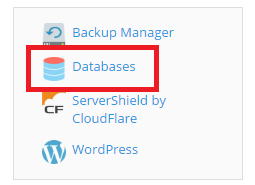
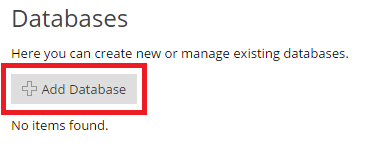
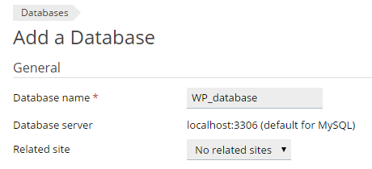
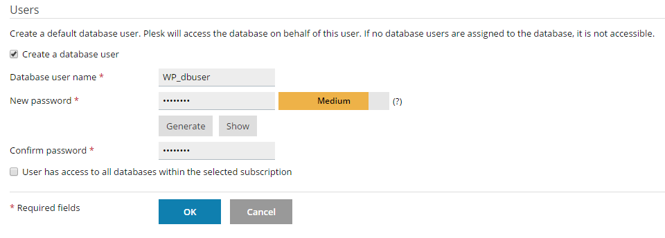
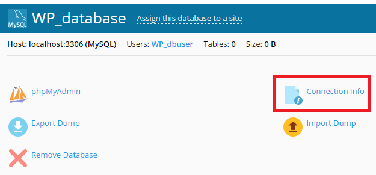
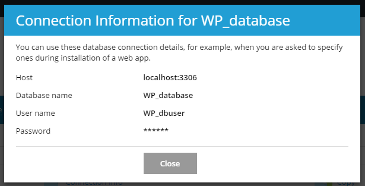

# Installing Swastika I/O Core CMS

Swastika I/O Core CMS is well-known for its ease of installation. Under most circumstances, installing Swastika I/O Core CMS is a very simple process and takes less than five minutes to complete. To install Swastika I/O Core CMS yourself, the following guide will help.

# Things to Know Before Installing

Before you begin the install, there are a few things you need to have and do.

These are:

- Access to your web server (via [FTP](https://codex.Swastika I/O Core CMS.org/Glossary#FTP))
- Ability to create [MS SQL Server](https://docs.microsoft.com/en-us/sql/relational-databases/databases/create-a-database) databases
- A [text editor](https://notepad-plus-plus.org/)
- An [FTP Client](https://filezilla-project.org/)
- Your web browser of choice

# Things You Need to Do to Install

Begin your installation by:

1. Checking to ensure that you and your web host have the minimum requirements to run Swastika I/O Core CMS.
2. Downloading the most current version of Swastika I/O Core CMS.
3. Unzipping the downloaded file to a folder on your hard drive.
4. Creating a secure password for your Secret Key
5. Keeping this webpage open so you have it handy during the installation.

# Famous 5-Minute Installation

Here's the quick version of the instructions for those who are already comfortable with performing such installations. More detailed instructions follow.

If you are not comfortable with renaming files, step 3 is optional and you can skip it as the install program will create the wp-config.php file for you.

1. Download and unzip the Swastika I/O Core CMS package if you haven't already.
2. Create a database for Swastika I/O Core CMS on your web server, as well as a MS SQL Server Database user who has all privileges for accessing and modifying it.
3. (Optional) Find and rename wp-config-sample.php to wp-config.php, then edit the file (see Editing wp-config.php) and add your database information. (TBC)
4. Upload the Swastika I/O Core CMS files to the desired location on your web server:
 - If you want to integrate Swastika I/O Core CMS into the root of your domain (e.g. http://example.com/), move or upload all contents of the unzipped Swastika I/O Core CMS directory (excluding the Swastika I/O Core CMS directory itself) into the root directory of your web server.
 - If you want to have your Swastika I/O Core CMS installation in its own subdirectory on your website (e.g. http://example.com/blog/), create the blog directory on your server and upload the contents of the unzipped Swastika I/O Core CMS package to the directory via FTP.
Note: If your FTP client has an option to convert file names to lower case, make sure it's disabled.

5. Run the Swastika I/O Core CMS installation script by accessing the URL in a web browser. This should be the URL where you uploaded the Swastika I/O Core CMS files.
 - If you installed Swastika I/O Core CMS in the root directory, you should visit: http://example.com/
 - If you installed Swastika I/O Core CMS in its own subdirectory called blog, for example, you should visit: http://example.com/blog/
That's it! Swastika I/O Core CMS should now be installed.

# Detailed Instructions
## Step 1: Download and Extract
Download and unzip the Swastika I/O Core CMS package from [https://github.com/Swastika-IO/Swastika-IO-Core/releases](https://github.com/Swastika-IO/Swastika-IO-Core/releases).

 - If you will be uploading Swastika I/O Core CMS to a remote web server, download the Swastika I/O Core CMS package to your computer with a web browser and unzip the package.
 - If you will be using FTP, skip Step 2 and go to the next step - uploading files is covered later.
 - If you have shell access to your web server, and are comfortable using console-based tools, you may wish to download Swastika I/O Core CMS directly to your web server using wget (or lynx or another console-based web browser) if you want to avoid FTPing:

```bash
wget https://github.com/Swastika-IO/Swastika-IO-Core/archive/latest.tar.gz
```
Then unzip the package using: 
```bash
tar -xzvf latest.tar.gz 
```

The Swastika I/O Core CMS package will extract into a folder called Swastika I/O Core CMS in the same directory that you downloaded latest.tar.gz.

## Step 2: Create the Database and a User

If you are using a hosting provider, you may already have a Swastika I/O Core CMS database set up for you, or there may be an automated setup solution to do so. Check your hosting provider's support pages or your control panel for clues about whether or not you'll need to create one manually.

If you determine that you'll need to create one manually, follow the instructions for accessing phpMyAdmin on various servers, or follow the instructions for Using Plesk, Using cPanel or Using phpMyAdmin below.

If you are installing Swastika I/O Core CMS on your own web server, follow the Using phpMyAdmin or Using the MySQL Client instructions below to create your Swastika I/O Core CMS username and database.

If you have only one database and it is already in use, you can install Swastika I/O Core CMS in it - just make sure to have a distinctive prefix for your tables to avoid over-writing any existing database tables.

### Using Plesk

Note: Plesk recommends all users to install and manage Swastika I/O Core CMS using the Swastika I/O Core CMS Toolkit. However, if you wish to install Swastika I/O Core CMS manually, follow these steps to create a database:

1. Log in to Plesk.
2. In the upper right corner of the screen, click Databases.

 

3. Click Add Database.

 

4. Type in the database name.

 

5. Type in the database user name and password, and then click Ok.

 

6. Once the database has been created, click Connection info to see the information you will need to connect to the database (database server hostname and port, database name, and the database user name). plesk 

 

 

## Step 3: Set up wp-config.php

## Step 4: Upload the files

Now you will need to decide where on your domain you'd like your Swastika I/O Core CMS-powered site to appear:

- In the root directory of your website. (For example, http://example.com/)
- In a subdirectory of your website. (For example, http://example.com/blog/)

**Note:** The location of your root web directory in the filesystem on your web server will vary across hosting providers and operating systems. Check with your hosting provider or system administrator if you do not know where this is.

### In the Root Directory
- If you need to upload your files to your web server, use an FTP client to upload all the contents of the Swastika I/O Core CMS directory (but not the directory itself) into the root directory of your website.
- If your files are already on your web server, and you are using shell access to install Swastika I/O Core CMS, move all of the contents of the Swastika I/O Core CMS directory (but not the directory itself) into the root directory of your website.

### In a Subdirectory
- If you need to upload your files to your web server, rename the Swastika I/O Core CMS directory to your desired name, then use an FTP client to upload the directory to your desired location within the root directory of your website.
- If your files are already on your web server, and you are using shell access to install Swastika I/O Core CMS, move the Swastika I/O Core CMS directory to your desired location within the root directory of your website, and rename the directory to your desired name.

**Note:** If your FTP client has an option to convert file names to lower case, make sure it's disabled.

## Step 5: Run the Install Script

Point a web browser to start the installation start point.

If you placed the Swastika I/O Core CMS files in the root directory, you should visit: http://example.com/en-us/portal/init
If you placed the Swastika I/O Core CMS files in a subdirectory called blog, for example, you should visit: http://example.com/blog/en-us/portal/init

